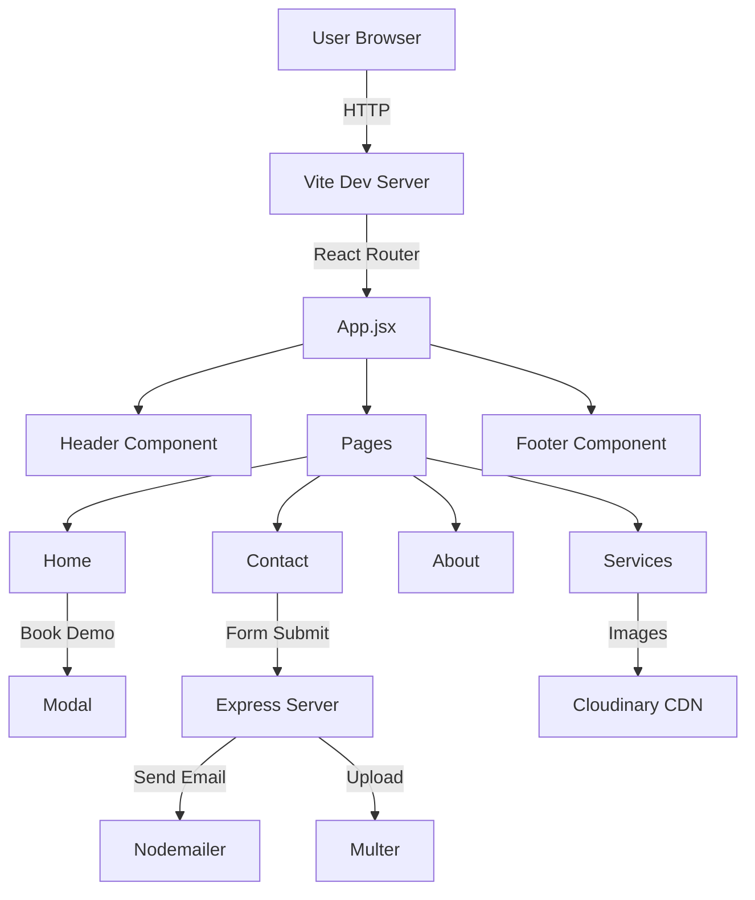
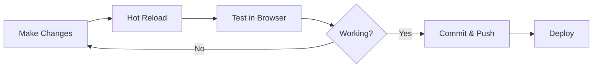

<div align="center">

<!-- Logo/Banner -->


<h3>
  
</h3>

<!-- Badges -->
<p>
  <a href="https://haventutors.com" target="_blank">
    
  </a>
  <a href="https://react.dev" target="_blank">
    
  </a>
  <a href="https://tailwindcss.com" target="_blank">
    
  </a>
  <a href="https://vitejs.dev" target="_blank">
    
  </a>
</p>

<!-- Quick Links -->
<p>
  <a href="https://haventutors.com">
    
  </a>
  <a href="#-features">
    
  </a>
  <a href="#-tech-stack">
    
  </a>
  <a href="#-getting-started">
    
  </a>
</p>

<!-- Stats -->
<p>
  
  
  
  
  
</p>

---

### 💡 *Connecting Students with Expert Educators Through Technology*

</div>

<br/>

## 🌟 About Haven Tutors

<table>
<tr>
<td width="50%">

Haven Tutors is a **cutting-edge online tutoring platform** that bridges the gap between passionate learners and world-class educators. 

Built with modern web technologies, we deliver:
- 🎓 **Personalized Learning Experiences**
- 🌐 **Global Accessibility**
- 💻 **State-of-the-Art Technology**
- 🤝 **Community-Driven Approach**

</td>
<td width="50%">

```javascript
const havenTutors = {
  mission: "Empower every student",
  vision: "World-class education",
  values: ["Excellence", "Innovation"],
  impact: {
    students: "5000+",
    tutors: "500+",
    subjects: "200+",
    countries: "50+"
  }
};
```

</td>
</tr>
</table>

### ✨ Why Choose Haven Tutors?

<table>
<tr>
<td align="center" width="33%">

<br/><br/>
<b>200+ Subjects</b>
<br/>
<sub>From K-12 to Professional<br/>Certifications & Beyond</sub>
</td>
<td align="center" width="33%">

<br/><br/>
<b>Expert Tutors</b>
<br/>
<sub>Vetted, Experienced<br/>Professional Educators</sub>
</td>
<td align="center" width="33%">

<br/><br/>
<b>Global Reach</b>
<br/>
<sub>Students from 50+<br/>Countries Worldwide</sub>
</td>
</tr>
<tr>
<td align="center" width="33%">

<br/><br/>
<b>Flexible Schedule</b>
<br/>
<sub>Learn at Your Own<br/>Pace & Convenience</sub>
</td>
<td align="center" width="33%">

<br/><br/>
<b>Mobile Responsive</b>
<br/>
<sub>Seamless Experience<br/>on Any Device</sub>
</td>
<td align="center" width="33%">

<br/><br/>
<b>Modern UI/UX</b>
<br/>
<sub>Clean, Intuitive<br/>Interface Design</sub>
</td>
</tr>
</table>

<br/>

## 🚀 Features

<details open>
<summary><b>🏠 Home Page - First Impressions Matter</b></summary>
<br/>

| Feature | Description |
|---------|-------------|
| 🎯 **Hero Section** | Eye-catching design with powerful call-to-action buttons |
| 📊 **Live Statistics** | Real-time showcase: 5000+ students, 500+ tutors, 200+ subjects |
| ✨ **Animated Icons** | Beautiful feature highlights with smooth animations |
| 💬 **Testimonials** | Dynamic carousel showcasing student success stories |
| 🎓 **Quick Demo Booking** | One-click access to demo class registration |

</details>

<details>
<summary><b>📚 Services - Comprehensive Subject Catalog</b></summary>
<br/>

```
✅ K-12 Education (Math, Science, Languages)
✅ International Boards (IB, IGCSE, Cambridge)
✅ Professional Certifications (IT, Finance, Marketing)
✅ Language Learning (15+ languages)
✅ Competitive Exams (SAT, ACT, GRE, GMAT)
✅ Arts & Music (Piano, Guitar, Painting, Dance)
```

**Key Features:**
- 🏷️ Smart categorization with dynamic filtering
- 🎴 Beautiful card-based layout with hover effects
- 🖼️ Cloudinary-powered image optimization
- 🔍 Easy search and discovery
- 📱 Fully responsive grid system

</details>

<details>
<summary><b>ℹ️ About Us - Our Story & Mission</b></summary>
<br/>

> *"Empowering students to reach their full potential through personalized education"*

- 📖 **Company Story** - How we started and where we're going
- 🎯 **Mission & Vision** - Interactive timeline with our core values
- 💼 **What We Do** - Detailed breakdown of our services
- 🔬 **Our Approach** - Unique teaching methodology
- 🏆 **Achievements** - Team statistics and success metrics

</details>

<details>
<summary><b>📞 Contact - Multiple Ways to Reach Us</b></summary>
<br/>

<table>
<tr>
<td>

**📧 Contact Form**
- Real-time validation
- Instant email notifications
- Auto-reply confirmations
- File attachment support

</td>
<td>

**🌐 Social Connect**
- Instagram, Facebook, LinkedIn
- YouTube channel
- WhatsApp instant messaging
- Phone & Email support

</td>
</tr>
</table>

</details>

<details>
<summary><b>🎓 Book Demo Modal - Seamless Registration</b></summary>
<br/>

**Student Application:**
- 📝 Full name, email, phone validation
- 🌍 International phone number format
- 📚 Subject, grade, and board selection
- 🗓️ Preferred date/time scheduling

**Tutor Application:**
- 👤 Professional information
- 🎓 Qualifications and experience
- 📄 Resume upload (PDF, DOC, DOCX)
- 🌏 Country and subject expertise

</details>

<br/>

## 🛠️ Tech Stack

<div align="center">

### Frontend Arsenal

<table>
<tr>
<td align="center" width="140">

<br/><b>React 18.3.1</b>
<br/><sub>UI Framework</sub>
</td>
<td align="center" width="140">

<br/><b>Tailwind CSS 4</b>
<br/><sub>Styling</sub>
</td>
<td align="center" width="140">

<br/><b>Vite 5.4</b>
<br/><sub>Build Tool</sub>
</td>
<td align="center" width="140">

<br/><b>JavaScript</b>
<br/><sub>ES6+</sub>
</td>
</tr>
<tr>
<td align="center" width="140">

<br/><b>Lucide React</b>
<br/><sub>Icons</sub>
</td>
<td align="center" width="140">

<br/><b>React Router 7</b>
<br/><sub>Routing</sub>
</td>
<td align="center" width="140">

<br/><b>React Hooks</b>
<br/><sub>State Logic</sub>
</td>
<td align="center" width="140">

<br/><b>Phone Input 2</b>
<br/><sub>International</sub>
</td>
</tr>
</table>

### Backend & Infrastructure

<table>
<tr>
<td align="center" width="140">

<br/><b>Node.js</b>
<br/><sub>Runtime</sub>
</td>
<td align="center" width="140">

<br/><b>Express.js</b>
<br/><sub>API Server</sub>
</td>
<td align="center" width="140">

<br/><b>Nodemailer</b>
<br/><sub>Email Service</sub>
</td>
<td align="center" width="140">

<br/><b>Cloudinary</b>
<br/><sub>Image CDN</sub>
</td>
</tr>
<tr>
<td align="center" width="140">

<br/><b>Multer</b>
<br/><sub>File Upload</sub>
</td>
<td align="center" width="140">

<br/><b>CORS</b>
<br/><sub>Security</sub>
</td>
<td align="center" width="140">

<br/><b>REST API</b>
<br/><sub>Endpoints</sub>
</td>
<td align="center" width="140">

<br/><b>Web Hosting</b>
<br/><sub>Production</sub>
</td>
</tr>
</table>

</div>

### 📦 Key Dependencies

```json
{
  "frontend": {
    "react": "^18.3.1",
    "react-router-dom": "^7.0.2",
    "lucide-react": "latest",
    "react-phone-input-2": "^2.15.1",
    "world-countries": "^5.0.0"
  },
  "backend": {
    "express": "^4.18.2",
    "nodemailer": "^6.9.7",
    "multer": "^1.4.5-lts.1",
    "cors": "^2.8.5"
  },
  "devDependencies": {
    "vite": "^5.4.11",
    "@vitejs/plugin-react": "^4.3.4",
    "tailwindcss": "^4.0.0"
  }
}
```

<br/>

---

## 📁 Project Structure

```bash
Haven/
┃
┣━━ 📂 src/                          # Frontend Source Code
┃   ┣━━ 📂 components/               # 🧩 Reusable UI Components
┃   ┃   ┣━━ 📄 Header.jsx            # ⬆️ Navigation Bar + Mobile Menu
┃   ┃   ┣━━ 📄 Footer.jsx            # ⬇️ Footer + Social Links
┃   ┃   ┣━━ 📄 BookDemoModal.jsx     # 🎓 Demo Booking Modal (Student/Tutor)
┃   ┃   └━━ 📄 ScrollToTop.jsx       # ⬆️ Route Change Scroll Handler
┃   ┃
┃   ┣━━ 📂 pages/                    # 📄 Page-Level Components
┃   ┃   ┣━━ 📄 Home.jsx              # 🏠 Landing Page (Hero, Stats, Testimonials)
┃   ┃   ┣━━ 📄 About.jsx             # ℹ️ Company Info (Mission, Vision, Story)
┃   ┃   ┣━━ 📄 Services.jsx          # 📚 Subject Catalog (200+ Subjects)
┃   ┃   └━━ 📄 Contact.jsx           # 📞 Contact Form + Info
┃   ┃
┃   ┣━━ 📄 App.jsx                   # 🎯 Main App Layout Wrapper
┃   ┣━━ 📄 main.jsx                  # 🚀 App Entry Point + Routing
┃   ┣━━ 📄 index.css                 # 🎨 Global Styles + Tailwind
┃   └━━ 📄 App.css                   # 🎨 App-Specific Styles
┃
┣━━ 📂 backend/                      # 💻 Backend Server
┃   ┣━━ 📄 server.js                 # ⚙️ Express API Server
┃   ┗━━ 📄 .env                      # 🔒 Environment Variables (not in repo)
┃
┣━━ 📂 public/                       # 📦 Static Assets
┃   ┗━━ 📂 fonts/                    # 🔤 Custom Fonts (Montserrat)
┃
┣━━ 📄 DESIGN_SYSTEM.md              # 🎨 Visual Design Guide & Style Guide
┣━━ 📄 package.json                  # 📦 Frontend Dependencies
┣━━ 📄 vite.config.js                # ⚡ Vite Configuration
┣━━ 📄 tailwind.config.js            # 🎨 Tailwind Configuration (if any)
┗━━ 📄 README.md                     # 📖 You Are Here!
```

<div align="center">

### 🏗️ Architecture Overview



</div>

<br/>

## 🎨 Design System

<table>
<tr>
<td width="50%">

### 🎨 Color Palette
```css
/* Primary Brand Colors */
Blue:    #2563eb  /* Buttons, Links, CTAs */
Slate:   #0f172a  /* Headings, Text */
Gray:    #f3f4f6  /* Backgrounds */

/* Accent Colors */
Pink:    #db2777  /* Instagram */
Green:   #22c55e  /* WhatsApp */
Red:     #dc2626  /* YouTube */
```

### 📝 Typography
- **Font**: Montserrat (400-800 weights)
- **Headings**: Bold, Slate-900
- **Body**: Regular, Slate-600
- **Line Height**: 1.45 default

</td>
<td width="50%">

### 🧱 Components Library

| Component | Usage |
|-----------|-------|
| 🔘 **Buttons** | Primary, Secondary, Icon |
| 🃏 **Cards** | Service, Testimonial, Info |
| 📝 **Forms** | Input, Select, Textarea |
| 🎭 **Modals** | Demo Booking, Alerts |
| 🎠 **Carousel** | Testimonials, Images |
| 🎯 **Icons** | Lucide React (480+ icons) |

### ⚡ Animations
- Hover transitions (200-300ms)
- Scale effects (hover:scale-110)
- Fade-in on scroll
- Smooth page transitions

</td>
</tr>
</table>

<div align="center">

### 📱 Responsive Breakpoints

| Device | Breakpoint | Layout |
|--------|------------|--------|
| 📱 Mobile | `< 640px` | Single column, stacked |
| 📱 Tablet | `640px - 768px` | 2 columns, flexible |
| 💻 Laptop | `768px - 1024px` | 3 columns, standard |
| 🖥️ Desktop | `1024px+` | 4 columns, wide |

**👉 Complete Design Documentation:** [DESIGN_SYSTEM.md](./DESIGN_SYSTEM.md)

</div>

<br/>

## 🚀 Getting Started

### 📋 Prerequisites

<table>
<tr>
<td>

**Required:**
- ✅ Node.js 18.x or higher
- ✅ npm 9.x or yarn 1.22+
- ✅ Git

</td>
<td>

**Optional:**
- 📧 Gmail account (for Nodemailer)
- ☁️ Cloudinary account (for images)
- 🌐 Domain & hosting

</td>
</tr>
</table>

### ⚡ Quick Start (3 Minutes Setup)

```bash
# 1️⃣ Clone the repository
git clone https://github.com/technovanam/Haven.git
cd Haven

# 2️⃣ Install frontend dependencies
npm install

# 3️⃣ Install backend dependencies
cd backend && npm install && cd ..

# 4️⃣ Run the app
npm run dev
```

<div align="center">

**🎉 That's it! Open http://localhost:5173 in your browser**

</div>

---

### 🔧 Detailed Installation

<details>
<summary><b>Step 1: Clone & Navigate</b></summary>

```bash
# Using HTTPS
git clone https://github.com/technovanam/Haven.git

# Or using SSH
git clone git@github.com:technovanam/Haven.git

# Navigate to project
cd Haven
```

</details>

<details>
<summary><b>Step 2: Install Dependencies</b></summary>

```bash
# Install frontend packages
npm install
# or
yarn install

# Install backend packages
cd backend
npm install
cd ..
```

**Key Packages Installed:**
- Frontend: React, React Router, Tailwind CSS, Lucide Icons
- Backend: Express, Nodemailer, Multer, CORS

</details>

<details>
<summary><b>Step 3: Environment Setup</b></summary>

Create a `.env` file in the `backend/` directory:

```env
# Email Configuration (Gmail)
EMAIL_USER=your-email@gmail.com
EMAIL_PASS=your-app-specific-password

# Cloudinary Configuration (Optional)
CLOUDINARY_CLOUD_NAME=your-cloud-name
CLOUDINARY_API_KEY=your-api-key
CLOUDINARY_API_SECRET=your-api-secret

# Server Configuration
PORT=5001
```

**📌 Note:** For Gmail, use [App Passwords](https://support.google.com/accounts/answer/185833) instead of your regular password.

</details>

<details>
<summary><b>Step 4: Run Development Servers</b></summary>

**Option A: Using Two Terminals (Recommended)**

```bash
# Terminal 1 - Frontend
npm run dev
# Runs on http://localhost:5173

# Terminal 2 - Backend
cd backend
node server.js
# Runs on http://localhost:5001
```

**Option B: Using Concurrent (if configured)**

```bash
npm run dev:all
# Runs both servers concurrently
```

</details>

<details>
<summary><b>Step 5: Build for Production</b></summary>

```bash
# Build frontend
npm run build

# Preview production build
npm run preview

# Deploy backend
cd backend
node server.js
```

**Output:** Optimized files in `dist/` folder ready for deployment.

</details>

---

### 🎯 Development Workflow



### 🔥 Useful Commands

| Command | Description |
|---------|-------------|
| `npm run dev` | Start frontend dev server |
| `npm run build` | Build for production |
| `npm run preview` | Preview production build |
| `npm run lint` | Check code quality |

<br/>

## 📸 Screenshots & Preview

<div align="center">

### 🏠 Home Page

<table>
<tr>
<td width="50%">

<p><b>Hero Section</b><br/>Eye-catching design with CTA</p>
</td>
<td width="50%">

<p><b>Live Statistics</b><br/>5000+ students, 500+ tutors</p>
</td>
</tr>
</table>

### 📚 Services Catalog

<table>
<tr>
<td width="50%">

<p><b>Smart Filtering</b><br/>Dynamic category tabs</p>
</td>
<td width="50%">

<p><b>Subject Cards</b><br/>Beautiful hover effects</p>
</td>
</tr>
</table>

### 📞 Contact & Demo Booking

<table>
<tr>
<td width="50%">

<p><b>Contact Form</b><br/>Real-time validation</p>
</td>
<td width="50%">

<p><b>Book Demo Modal</b><br/>Student/Tutor tabs</p>
</td>
</tr>
</table>

**🎬 Live Demo:** [haventutors.com](https://haventutors.com)

<sub>*Screenshots are placeholders - replace with actual website screenshots*</sub>

</div>

<br/>

## 🌐 Live Demo & Links

<div align="center">

### 🚀 Visit Our Website

<a href="https://haventutors.com" target="_blank">
  
</a>

<br/><br/>

### � Connect With Us

<p>
  <a href="https://www.facebook.com/haventutors" target="_blank">
    
  </a>
  <a href="https://www.instagram.com/haven__tutors" target="_blank">
    
  </a>
  <a href="https://www.linkedin.com/in/haven-tutors-5b89b638b" target="_blank">
    
  </a>
  <a href="https://youtube.com/@haventutors" target="_blank">
    
  </a>
  <a href="https://wa.me/+919606840892" target="_blank">
    
  </a>
</p>

</div>

---

## 📫 Contact Information

<table>
<tr>
<td align="center" width="33%">

<br/><br/>
<b>Website</b>
<br/>
<a href="https://haventutors.com">haventutors.com</a>
</td>
<td align="center" width="33%">

<br/><br/>
<b>Email</b>
<br/>
<a href="mailto:haventutors@gmail.com">haventutors@gmail.com</a>
</td>
<td align="center" width="33%">

<br/><br/>
<b>Phone</b>
<br/>
<a href="tel:+919606840892">+91 960 684 0892</a>
</td>
</tr>
</table>

<div align="center">

### 💬 Get In Touch

Have questions? Want to collaborate? We'd love to hear from you!

<a href="https://haventutors.com/contact">
  
</a>
<a href="https://haventutors.com/book-demo">
  
</a>

</div>

<br/>

## 🤝 Contributing

<div align="center">

**We Welcome Contributions! 🎉**

Help us make Haven Tutors even better for students worldwide.

</div>

### 🌟 How to Contribute

<table>
<tr>
<td width="25%" align="center">

<br/><b>1. Fork</b>
<br/>
<sub>Fork the repository</sub>
</td>
<td width="25%" align="center">

<br/><b>2. Code</b>
<br/>
<sub>Create feature branch</sub>
</td>
<td width="25%" align="center">

<br/><b>3. Commit</b>
<br/>
<sub>Commit your changes</sub>
</td>
<td width="25%" align="center">

<br/><b>4. PR</b>
<br/>
<sub>Open Pull Request</sub>
</td>
</tr>
</table>

### 📝 Contribution Guidelines

```bash
# 1. Fork and clone
git clone https://github.com/YOUR_USERNAME/Haven.git
cd Haven

# 2. Create feature branch
git checkout -b feature/AmazingFeature

# 3. Make your changes and commit
git add .
git commit -m "✨ Add: Amazing new feature"

# 4. Push to your fork
git push origin feature/AmazingFeature

# 5. Open Pull Request on GitHub
```

**Commit Message Convention:**
- ✨ `feat:` New feature
- 🐛 `fix:` Bug fix
- 📝 `docs:` Documentation
- 💄 `style:` UI/styling
- ♻️ `refactor:` Code refactoring
- ⚡ `perf:` Performance improvement

---

## 📝 License

<div align="center">

**Proprietary & Confidential**

```
Copyright © 2025 Haven Tutors. All Rights Reserved.

This project and its contents are proprietary and confidential.
Unauthorized copying, distribution, or use is strictly prohibited.
```

For licensing inquiries: **haventutors@gmail.com**

</div>

---

## 🙏 Acknowledgments

<table>
<tr>
<td align="center" width="20%">

<br/><b>React Team</b>
<br/><sub>UI Framework</sub>
</td>
<td align="center" width="20%">

<br/><b>Tailwind Labs</b>
<br/><sub>CSS Framework</sub>
</td>
<td align="center" width="20%">

<br/><b>Vite Team</b>
<br/><sub>Build Tool</sub>
</td>
<td align="center" width="20%">

<br/><b>Lucide Icons</b>
<br/><sub>Icon Library</sub>
</td>
<td align="center" width="20%">

<br/><b>Cloudinary</b>
<br/><sub>Image CDN</sub>
</td>
</tr>
</table>

### 🌟 Special Thanks To

- **Open Source Community** for amazing tools and libraries
- **Contributors** who help improve this project
- **Students & Tutors** who trust Haven Tutors
- **GitHub** for hosting and collaboration tools

---

<div align="center">

## 💖 Support This Project


### ⭐ Star this repository if you find it helpful!

<a href="https://github.com/technovanam/Haven/stargazers">
  
</a>
<a href="https://github.com/technovanam/Haven/network/members">
  
</a>
<a href="https://github.com/technovanam/Haven/watchers">
  
</a>

<br/><br/>

**Made with ❤️ by the Haven Tutors Team**

<sub>Empowering Education Through Technology</sub>

<br/><br/>

<a href="#-haven-tutors">
  
</a>

<br/><br/>

---

<sub>Last Updated: October 2025 | Version 1.0.0</sub>

</div>
